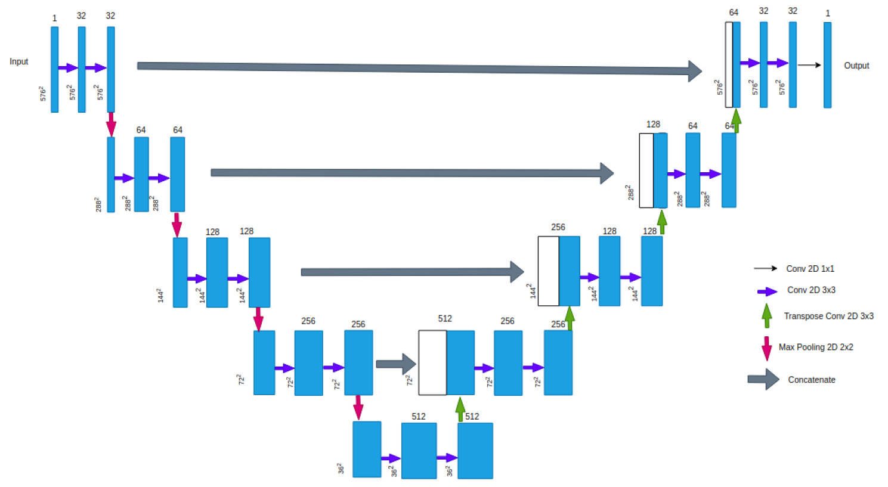

# UNet_ImageSegmentation
To try and implement UNet (see arch on the image below) with Tensorflow.  
Wonder if IB principle can be applied to UNet as there is no information loss at the concatenation channels?  

